# ☁️ Construyendo sobre la nube
# 🖥 Una inmersión a las máquinas virtuales de AWS

<div align="center"></div>

### Introducción

En este proyecto se muestra como crear una máquina virtual en AWS y como desplegar una aplicación web en ella. La aplicación web es un servidor web escrito en Go que:
- Muestra un mensaje de bienvenida
- Crea un usuario
- Muestra la lista de usuarios creados

### Creación de la máquina virtual

1. Ingresar a la consola de AWS y seleccionar la región en la que se desea crear la máquina virtual (no se te olvide la región donde creaste tu máquina virtual).

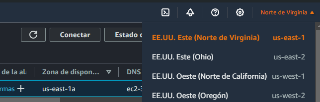

2. En el menú de servicios, seleccionar EC2.

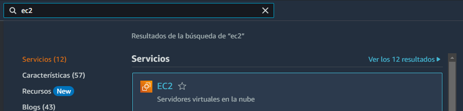

3. En el panel de la izquierda, seleccionar "Instancias".

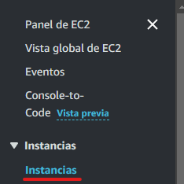

4. En la parte superior derecha, seleccionar "Lanzar instancias".

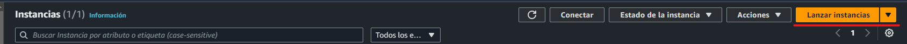

5. Agregale un nombre a tu máquina virtual.

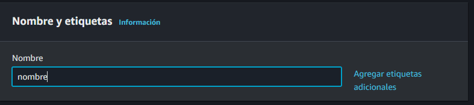

6. Selecciona una imagen de Amazon Machine Image (AMI). En este caso, se selecciona Amazon Linux 2 AMI (pero si quieres también pueses usar Ubuntu).

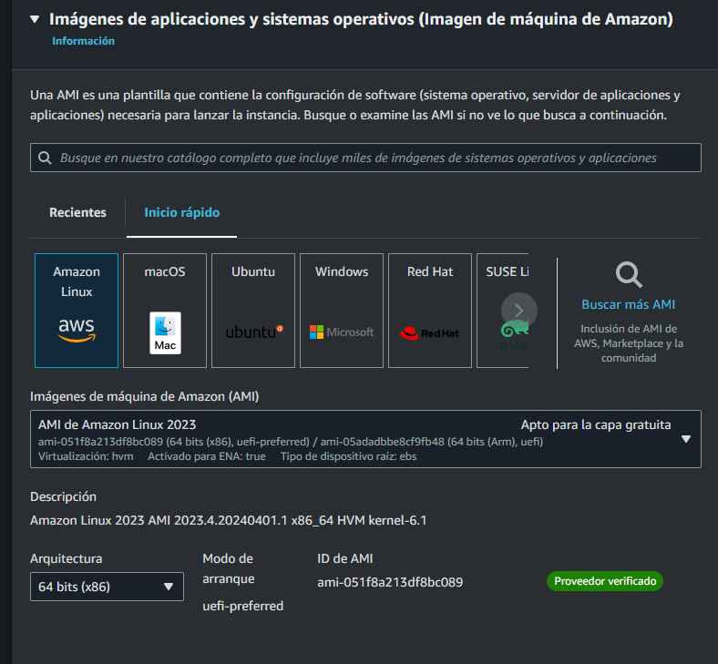

7. Selecciona el tipo de instancia. En este caso, se selecciona t2.micro (ya que es la apta de la capa gratuita).

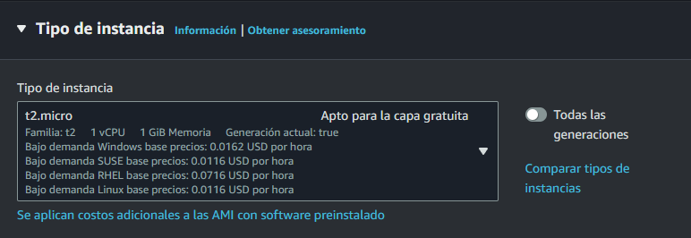

8. Si no tienes una llave, crea una nueva.

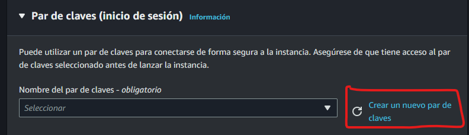

9. Manten la configuración de abajo y agregale un nombre a tu llave.

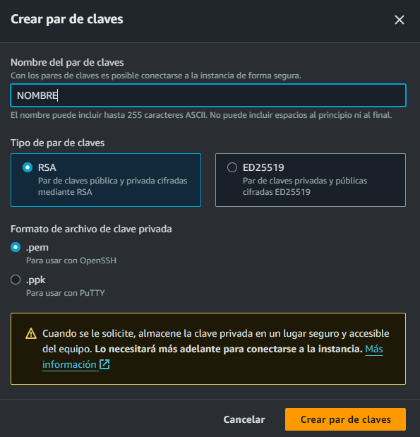

10. Selecciona la llave que acabas de crear.

11. En la configuración de red habilita el tráfico HTTP.


12. Revisa la configuración y que unicamente se crea 1 instancia, luego selecciona "Lanzar Instancia".

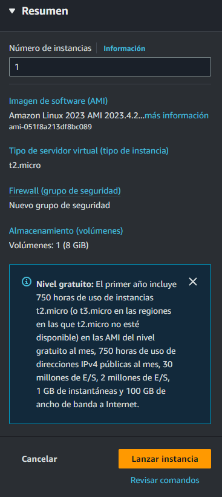

13. ¡Listo! Ya creaste tu primera máquina virtual en AWS EC2.

### Conexión a la máquina virtual con Termius

1. Descarga Termius en [https://termius.com/](https://termius.com/).

2. Crea una cuenta en Termius utilizando la cuenta institucional para tener los beneficios del github student pack.

3. Ya en Termius, selecciona "Hosts" y luego "New Host".

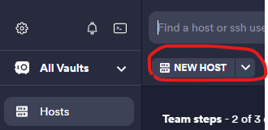

4. Agrega la IP pública de tu máquina virtual en el campo "Address".

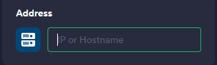

5. En el campo "Username" agrega `ec2-user`.

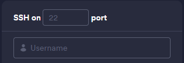

6. Selecciona "Key"

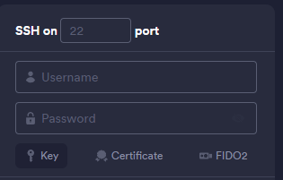

7. Ponle un nombre a tu llave y selecciona que la vas a crear.

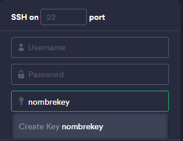

8. Ve al apartado de `import` y arrastra la llave que creaste en AWS.


9. Guarda la llave y selecciona "Save".


10. Presiona "Connect".

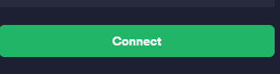

11. ¡Listo! Ya te conectaste a tu máquina virtual de AWS EC2.


### Instalaciónes necesarias en Amazon Linux 

- Golang
```bash
sudo yum install -y golang
```

- Git
```bash
sudo yum install -y git
```

### Habilitar el puerto de la API

1. En la consola de AWS, selecciona la máquina virtual y selecciona "Seguridad".

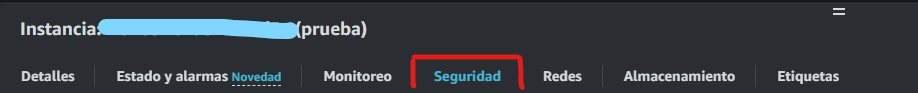

2. Selecciona el grupo de seguridad.

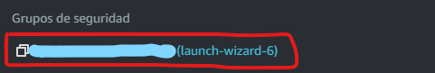

3. Ve a reglas de entrada y selecciona "Editar reglas de entrada".

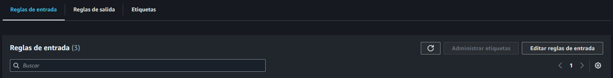

4. Selecciona el botón de "Agregar regla".

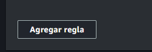

5. Agrega la siguiente configuración y en el puerto escribes el puerto de tu API, en este caso puerto 3000.

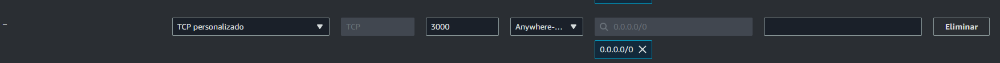

6. Selecciona "Guardar reglas".

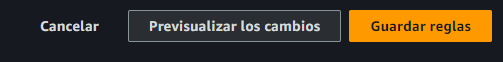

### Recomendaciones

- Al iniciar sesión en la máquina virtual, se usa el usuario de ```ec2-user```. Para ejecutar comandos como superusuario, se debe usar ```sudo```.

- No guardes la clave privada en un lugar accesible para todos (como tu repositorio) ya que pueden acceder a tu maquina virtual sin tu permiso. La clave privada es la única forma de acceder a la máquina virtual.

- Siempre que termines de usar la máquina virtual, recuerda detenerla para no seguir generando costos.

- Cuando ya no necesites la máquina virtual, recuerda terminarla para no seguir generando costos.

### Contacto

rodrialehdl@gmail.com
